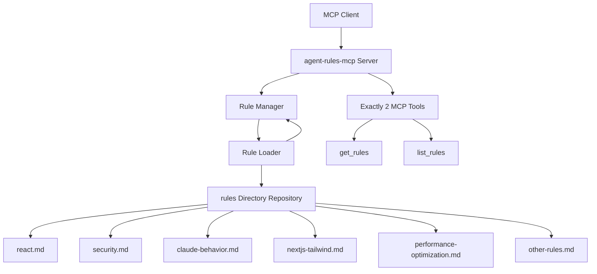

# Design Document

## Overview

The agent-rules-mcp server is a Node.js Model Context Protocol (MCP) server built using the official TypeScript SDK (@modelcontextprotocol/sdk). It follows a simple, file-based architecture that dynamically loads rule content from markdown files in the repository's `rules/` folder and exposes them through exactly two MCP tools: `get_rules` and `list_rules`. The design allows contributors to add new rule files via PRs, making them immediately available through the MCP server without any external API dependencies.

## Architecture



### Core Components

1. **MCP Server**: Main server instance using @modelcontextprotocol/sdk
2. **Rule Manager**: Central component managing rule loading, caching, and file watching
3. **Repository File Reader**: Reads rule files directly from the repository's `rules/` directory on each request
4. **Rule Loader**: Handles markdown file parsing and content extraction with filename-to-domain mapping
5. **Exactly 2 MCP Tools**: `get_rules` and `list_rules` tools that interface with the Rule Manager

## Components and Interfaces

### Rule Manager

```typescript
interface RuleManager {
  getRuleContent(domain: string): Promise<RuleContent | null>;
  listAvailableDomains(): Promise<DomainInfo[]>;
  scanRulesDirectory(): Promise<string[]>; // Scan local rules/ folder
}

interface RuleContent {
  domain: string;
  content: string;
  description?: string;
  lastUpdated?: string;
  version?: string;
}

interface DomainInfo {
  domain: string;
  description: string;
  lastUpdated?: string;
}
```

### MCP Tools (Exactly 2 Tools)

```typescript
// get_rules tool - retrieves content for a specific domain
interface GetRulesInput {
  domain: string; // filename without .md extension (e.g., "react", "security")
}

interface GetRulesOutput {
  domain: string;
  content: string; // clean, readable content suitable for AI agent consumption
  metadata?: {
    description?: string;
    lastUpdated?: string;
    version?: string;
  };
}

// list_rules tool - discovers all available domains
interface ListRulesOutput {
  domains: DomainInfo[];
  totalCount: number;
  message?: string; // for empty directory case
}
```

### Repository File System Access

The server reads directly from repository files, no external APIs:

```typescript
interface RepositoryFileReader {
  // Read specific rule file from repository's rules/ directory
  readRuleFile(domain: string): Promise<string>;
  
  // List all .md files in repository's rules/ directory
  listRuleFiles(): Promise<string[]>;
  
  // Check if rule file exists in repository
  ruleExists(domain: string): Promise<boolean>;
  
  // Parse markdown content and extract metadata
  parseRuleContent(content: string): RuleContent;
}

// Repository-based implementation:
// - Direct file system access to repository files using Node.js fs
// - No external API dependencies
// - Fresh data on every request
// - New PR contributions automatically available when repository is updated
```

## Data Models

### Rule File Structure

Rule files are standard markdown files with optional metadata sections. The filename (without .md extension) becomes the domain name:

```markdown
# Domain Name Rules

- Last Updated: 2025-01-26
- Description: Brief description of the rules
- Version: 1.0

## Rule Content

Your rules, best practices, examples, etc.
```

**File-to-Domain Mapping Examples:**
- `rules/react.md` → domain: "react"
- `rules/security.md` → domain: "security"  
- `rules/claude-behavior.md` → domain: "claude-behavior"
- `rules/nextjs-tailwind.md` → domain: "nextjs-tailwind"

### Internal Data Storage

- **Rules Cache**: In-memory Map<string, RuleContent> for fast access
- **File Metadata**: Track file modification times for change detection
- **Domain Registry**: List of available domains with descriptions

## Error Handling

### File System Errors

1. **Missing Rules Directory**: Create directory if it doesn't exist, log informational message
2. **Invalid Markdown Files**: Log errors but continue operating with valid files (Requirement 3.4)
3. **File Permission Issues**: Log warnings and skip inaccessible files
4. **Repository Sync Issues**: Handle cases where repository updates don't reflect immediately

### MCP Tool Errors

1. **Invalid Domain Request**: Return appropriate error message with available domains (Requirement 1.3)
2. **Empty Rules Directory**: Return empty list with appropriate message (Requirement 2.3)
3. **File Read Errors**: Return helpful error message with troubleshooting guidance (Requirement 1.4)
4. **Malformed Parameters**: Validate input and return clear error messages (Requirement 1.4)

### Error Response Format

```typescript
interface ErrorResponse {
  error: string;
  code: string;
  details?: string;
  suggestions?: string[];
}
```

## Testing Strategy

### Unit Tests

1. **Rule Manager Tests**
   - File loading and parsing
   - Cache management
   - Error handling for invalid files

2. **Rule Loading Tests**
   - Repository scanning and loading
   - File parsing and domain mapping
   - Periodic refresh functionality

3. **MCP Tool Tests**
   - get_rules functionality
   - list_rules functionality
   - Error scenarios

### Integration Tests

1. **End-to-End MCP Communication**
   - Client-server interaction
   - Tool invocation and responses
   - Error propagation

2. **Repository Integration**
   - Repository-based file loading
   - Rule scanning and parsing
   - Server restart scenarios

### Test Data

- Sample rule files for different domains
- Invalid markdown files for error testing
- Empty directory scenarios
- Large file handling tests

## Repository-Based Contribution Workflow

### Direct Repository File Access (No APIs)

1. **MCP Tool Call**: Client calls `get_rules("react")` or `list_rules()`
2. **Repository Check**: Server checks if `rules/react.md` exists in the repository
3. **File Read**: Read file content directly from repository using Node.js fs.readFile
4. **Content Processing**: Parse markdown content and extract metadata
5. **Response**: Return content immediately to client

### Contribution Workflow

- **Contributor**: Creates PR adding `rules/new-domain.md` to agent-rules-mcp repository
- **Review & Merge**: You review and merge the PR
- **Deployment**: Repository is deployed/updated with new rule file
- **Availability**: New rule domain immediately available via `get_rules("new-domain")`

### Repository Update Detection

- **Add New File**: PR adds `rules/new-domain.md` → Available after deployment
- **Modify Existing**: PR updates `rules/react.md` → Fresh content after deployment
- **Delete File**: PR removes `rules/security.md` → Domain no longer available
- **Immediate Access**: Changes reflected immediately when repository files are updated

### Community Contribution Model

- **Open Source**: Contributors can add new rule domains via PRs
- **Quality Control**: You review all contributions before merging
- **Scalable**: Community can expand the rule database
- **Simple**: No complex infrastructure, just repository files

### No External Dependencies

- **No GitHub API**: Direct file system access to repository files
- **No Authentication**: No API keys or tokens needed
- **No Network Calls**: All data read from repository files
- **Simple Architecture**: Repository serves as the database

## Performance Considerations

### Caching Strategy

- Load all rules into memory on startup
- Refresh cache only when files change
- Use file modification times to detect changes

### Repository-Based Loading Optimization

- Load all rules into memory on startup for fast access
- Use file modification timestamps to detect changes during periodic scans
- Implement efficient file parsing with minimal memory overhead
- Cache parsed content to avoid re-parsing on each request
- Support for large rule files with streaming if needed

### Memory Management

- Limit maximum file size for rule files
- Implement cache size limits if needed
- Clean up resources on server shutdown

## Security Considerations

### File System Security

- Restrict access to the designated rules directory only
- Validate file paths to prevent directory traversal
- Sanitize file content before serving

### Input Validation

- Validate domain names against allowed characters
- Limit parameter sizes to prevent abuse
- Sanitize markdown content for safe consumption

## Configuration

### Environment Variables

```typescript
interface ServerConfig {
  RULES_DIRECTORY: string;        // Default: "./rules"
  RULES_DIRECTORY: string;        // Default: "./rules"
  LOG_LEVEL: string;             // Default: "info"
  MAX_FILE_SIZE: number;         // Default: 1MB
  CACHE_TTL: number;             // Default: 0 (no TTL)
}
```

### Runtime Configuration

- Configurable rules directory path
- Configurable rules directory path
- Simple file-based configuration
- Standard MCP transport support
- Logging level configuration
- Performance tuning parameters